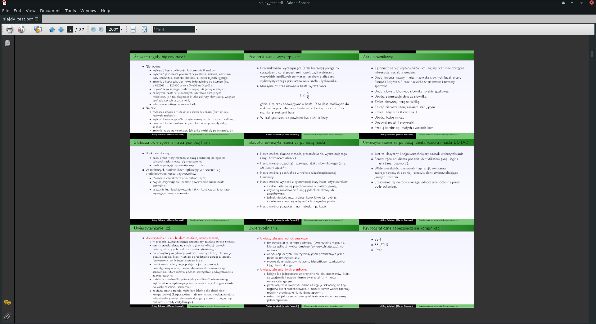

Tested with Gimp 2.10.14

Usage: 
1. open Gimp
2. File > Open, and choose the PDF file you want to edit 
3. In the new dialog, choose option *open pages as layers*
4. All layers should be named with integers starting from 1
5. Choose Filters > Python-Fu > Console...
6. In the script: pick your value for n (the number of slides per page, its square root should be an integer)
7. Paste the script into the console
8. After a while you should get a set of new layers consisting of smaller and positioned n slides
9. Choose File > Export As... 
10. Choose PDF type and in the new dialog *layers as pages* option

Voila

